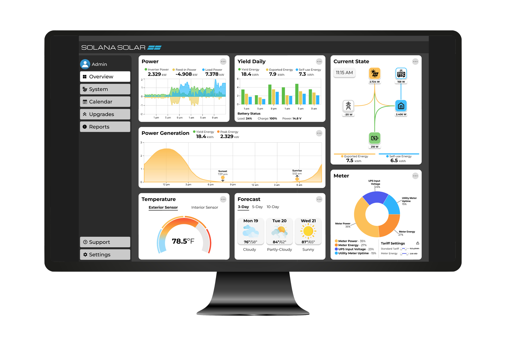

<h1>Hi there! 👋</h1>

My name is Sam and I enjoy a hybrid of both product design and frontend development. <a href="https://www.samtreadwell.com" alt="Sam Treadwell's portfolio website">samtreadwell.com</a>

  

<h2>Tech I have experience with</h2>
<ul>
  <li>💻 HTML, CSS, JavaScript, Node.js</li>
  <li>📝 Advanced JavaScript, TypeScript, React, Tailwind CSS, Next.js</li>
  <li>🎨 Figma, Sketch, Adobe Creative Suite</li>
</ul>

I have 2 years of experience with web development and design and am currently learning JavaScript frameworks.

<h2>Project example</h2>

<h3>Solar Dashboard UI</h3>

